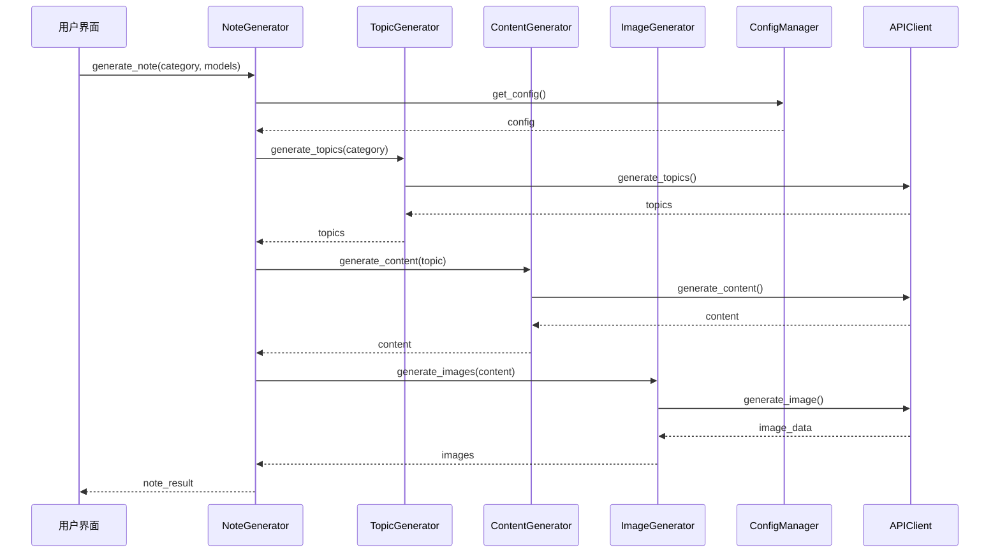
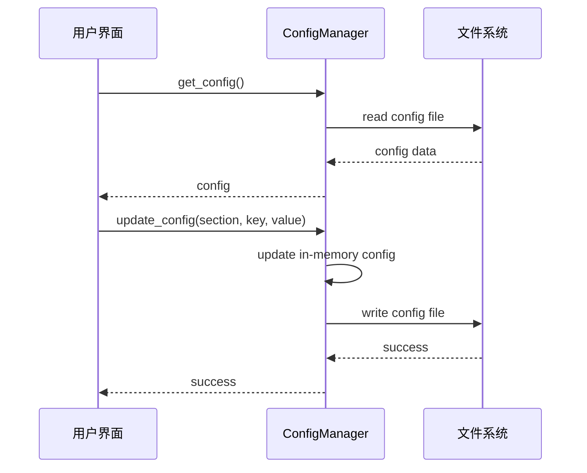

# 小红书笔记生成Agent系统架构设计

## 1. 系统整体架构

### 1.1 架构图
```
┌─────────────────────────────────────────────────────────────┐
│                    用户界面层 (UI Layer)                      │
│  ┌─────────────┐  ┌─────────────┐  ┌─────────────┐         │
│  │ Web界面     │  │ 命令行界面  │  │ 配置管理界面 │         │
│  └─────────────┘  └─────────────┘  └─────────────┘         │
└─────────────────────────────────────────────────────────────┘
                              │
┌─────────────────────────────────────────────────────────────┐
│                    业务逻辑层 (Business Layer)                │
│  ┌─────────────┐  ┌─────────────┐  ┌─────────────┐         │
│  │ 选题模块     │  │ 文案生成模块 │  │ 图片生成模块 │         │
│  └─────────────┘  └─────────────┘  └─────────────┘         │
└─────────────────────────────────────────────────────────────┘
                              │
┌─────────────────────────────────────────────────────────────┐
│                    数据访问层 (Data Layer)                    │
│  ┌─────────────┐  ┌─────────────┐  ┌─────────────┐         │
│  │ 配置管理     │  │ API客户端    │  │ 文件存储     │         │
│  └─────────────┘  └─────────────┘  └─────────────┘         │
└─────────────────────────────────────────────────────────────┘
```

### 1.2 模块依赖关系
```
用户界面 → 业务逻辑层 → 数据访问层
    ↓         ↓            ↓
配置管理 ← 配置管理 ← 配置管理
```

## 2. 核心模块设计

### 2.1 配置管理模块 (ConfigManager)

#### 2.1.1 主要类型
```python
class ConfigManager:
    """配置管理器，负责读取和管理系统配置"""
    
    def __init__(self, config_path: str):
        """初始化配置管理器"""
        
    def get_config(self) -> Dict[str, Any]:
        """获取完整配置"""
        
    def get_api_config(self, api_name: str) -> Dict[str, Any]:
        """获取特定API配置"""
        
    def get_prompt_config(self, prompt_name: str) -> str:
        """获取特定提示词配置"""
        
    def update_config(self, section: str, key: str, value: Any) -> None:
        """更新配置"""
        
    def save_config(self) -> None:
        """保存配置到文件"""
```

#### 2.1.2 配置文件结构
```yaml
# config.yaml
apis:
  deepseek:
    api_key: "your_deepseek_api_key"
    base_url: "https://api.deepseek.com"
    model: "deepseek-chat"
  
  doubao:
    api_key: "your_doubao_api_key"
    base_url: "https://ark.cn-beijing.volces.com/api/v3"
    model: "doubao-pro-4k"
    
  jimeng:
    api_key: "your_jimeng_api_key"
    base_url: "https://jimeng.jianying.com"
    
  tongyi:
    api_key: "your_tongyi_api_key"
    base_url: "https://dashscope.aliyuncs.com/api/v1"
    model: "wanx-v1"

prompts:
  topic_generation: "请为小红书平台生成5个关于{category}的热门选题..."
  content_generation: "根据以下选题：'{topic}'，生成小红书笔记..."
  image_generation: "根据以下标题：'{title}'和内容：'{content}'，生成小红书风格图片..."

output:
  image_dir: "./output/images"
  content_dir: "./output/content"
  log_dir: "./logs"

ui:
  theme: "light"
  language: "zh-CN"
```

### 2.2 API客户端模块 (APIClient)

#### 2.2.1 基础API客户端
```python
class BaseAPIClient:
    """API客户端基类"""
    
    def __init__(self, config: Dict[str, Any]):
        """初始化API客户端"""
        
    async def generate_response(self, prompt: str, **kwargs) -> str:
        """生成响应，子类需要实现"""
        raise NotImplementedError
```

#### 2.2.2 Deepseek API客户端
```python
class DeepseekAPIClient(BaseAPIClient):
    """Deepseek API客户端"""
    
    def __init__(self, config: Dict[str, Any]):
        """初始化Deepseek API客户端"""
        
    async def generate_response(self, prompt: str, **kwargs) -> str:
        """调用Deepseek API生成响应"""
        
    async def generate_topics(self, category: str, count: int = 5) -> List[Dict[str, str]]:
        """生成选题"""
        
    async def generate_content(self, topic: str, **kwargs) -> Dict[str, Any]:
        """生成文案内容"""
```

#### 2.2.3 豆包API客户端
```python
class DoubaoAPIClient(BaseAPIClient):
    """豆包API客户端"""
    
    def __init__(self, config: Dict[str, Any]):
        """初始化豆包API客户端"""
        
    async def generate_response(self, prompt: str, **kwargs) -> str:
        """调用豆包API生成响应"""
        
    async def generate_content(self, topic: str, **kwargs) -> Dict[str, Any]:
        """生成文案内容"""
```

#### 2.2.4 图片生成API客户端
```python
class ImageGenerationClient(BaseAPIClient):
    """图片生成API客户端基类"""
    
    async def generate_image(self, prompt: str, **kwargs) -> bytes:
        """生成图片，子类需要实现"""
        raise NotImplementedError

class JimengAPIClient(ImageGenerationClient):
    """即梦API客户端"""
    
    async def generate_image(self, prompt: str, **kwargs) -> bytes:
        """调用即梦API生成图片"""

class TongyiAPIClient(ImageGenerationClient):
    """通义万象API客户端"""
    
    async def generate_image(self, prompt: str, **kwargs) -> bytes:
        """调用通义万象API生成图片"""
```

### 2.3 选题模块 (TopicGenerator)

#### 2.3.1 主要类型
```python
class TopicGenerator:
    """选题生成器"""
    
    def __init__(self, config_manager: ConfigManager):
        """初始化选题生成器"""
        
    async def generate_topics(self, category: str = None, count: int = 5) -> List[Dict[str, str]]:
        """生成选题列表"""
        
    def _build_topic_prompt(self, category: str) -> str:
        """构建选题提示词"""
        
    def _parse_topic_response(self, response: str) -> List[Dict[str, str]]:
        """解析选题响应"""
```

#### 2.3.2 数据类型
```python
@dataclass
class Topic:
    """选题数据类"""
    title: str
    description: str
    category: str
    tags: List[str]
```

### 2.4 文案生成模块 (ContentGenerator)

#### 2.4.1 主要类型
```python
class ContentGenerator:
    """文案生成器"""
    
    def __init__(self, config_manager: ConfigManager):
        """初始化文案生成器"""
        
    async def generate_content(self, topic: Topic, model: str = "deepseek") -> Dict[str, Any]:
        """生成文案内容"""
        
    def _build_content_prompt(self, topic: Topic) -> str:
        """构建文案提示词"""
        
    def _parse_content_response(self, response: str) -> Dict[str, Any]:
        """解析文案响应"""
        
    async def select_model(self, model_name: str) -> BaseAPIClient:
        """选择使用的模型"""
```

#### 2.4.2 数据类型
```python
@dataclass
class Content:
    """文案内容数据类"""
    titles: List[str]  # 多个标题选项
    body: str  # 正文内容
    tags: List[str]  # 标签
    topic: Topic  # 关联的选题
```

### 2.5 图片生成模块 (ImageGenerator)

#### 2.5.1 主要类型
```python
class ImageGenerator:
    """图片生成器"""
    
    def __init__(self, config_manager: ConfigManager):
        """初始化图片生成器"""
        
    async def generate_images(self, content: Content, model: str = "jimeng", count: int = 3) -> List[str]:
        """生成图片"""
        
    def _build_image_prompt(self, content: Content) -> str:
        """构建图片提示词"""
        
    async def select_model(self, model_name: str) -> ImageGenerationClient:
        """选择使用的图片生成模型"""
        
    async def save_image(self, image_data: bytes, filename: str) -> str:
        """保存图片到本地"""
```

#### 2.5.2 数据类型
```python
@dataclass
class ImageResult:
    """图片生成结果数据类"""
    file_path: str  # 图片保存路径
    prompt: str  # 生成图片的提示词
    model: str  # 使用的模型
    content: Content  # 关联的文案内容
```

### 2.6 笔记生成器 (NoteGenerator)

#### 2.6.1 主要类型
```python
class NoteGenerator:
    """小红书笔记生成器，整合各模块功能"""
    
    def __init__(self, config_manager: ConfigManager):
        """初始化笔记生成器"""
        
    async def generate_note(self, category: str = None, 
                           content_model: str = "deepseek",
                           image_model: str = "jimeng") -> Dict[str, Any]:
        """一键生成完整笔记"""
        
    async def generate_note_from_topic(self, topic: Topic,
                                     content_model: str = "deepseek",
                                     image_model: str = "jimeng") -> Dict[str, Any]:
        """根据指定选题生成笔记"""
```

#### 2.6.2 数据类型
```python
@dataclass
class NoteResult:
    """笔记生成结果数据类"""
    topic: Topic  # 选题
    content: Content  # 文案内容
    images: List[ImageResult]  # 生成的图片
    created_at: datetime  # 创建时间
```

## 3. 用户界面模块设计

### 3.1 Web界面 (Streamlit)

#### 3.1.1 主要类型
```python
class StreamlitUI:
    """Streamlit Web界面"""
    
    def __init__(self, config_manager: ConfigManager):
        """初始化Web界面"""
        
    def render_sidebar(self) -> Dict[str, Any]:
        """渲染侧边栏配置"""
        
    def render_main_content(self) -> None:
        """渲染主要内容区"""
        
    def render_config_page(self) -> None:
        """渲染配置页面"""
        
    def render_generation_page(self) -> None:
        """渲染生成页面"""
        
    def display_results(self, note_result: NoteResult) -> None:
        """显示生成结果"""
```

### 3.2 命令行界面 (CLI)

#### 3.2.1 主要类型
```python
class CLI:
    """命令行界面"""
    
    def __init__(self, config_manager: ConfigManager):
        """初始化命令行界面"""
        
    def parse_args(self) -> argparse.Namespace:
        """解析命令行参数"""
        
    async def run_generation(self, args: argparse.Namespace) -> None:
        """运行生成流程"""
        
    def display_results(self, note_result: NoteResult) -> None:
        """显示生成结果"""
```

## 4. 模块交互流程

### 4.1 一键生成笔记流程


### 4.2 配置管理流程


## 5. 项目目录结构

```
小红书笔记生成/
├── README.md                 # 项目说明
├── requirements.txt          # 依赖包
├── config.yaml              # 配置文件
├── main.py                  # 主入口文件
├── src/                     # 源代码目录
│   ├── __init__.py
│   ├── config/              # 配置管理
│   │   ├── __init__.py
│   │   └── config_manager.py
│   ├── api/                 # API客户端
│   │   ├── __init__.py
│   │   ├── base_client.py
│   │   ├── deepseek_client.py
│   │   ├── doubao_client.py
│   │   ├── jimeng_client.py
│   │   └── tongyi_client.py
│   ├── generators/           # 生成器模块
│   │   ├── __init__.py
│   │   ├── topic_generator.py
│   │   ├── content_generator.py
│   │   ├── image_generator.py
│   │   └── note_generator.py
│   ├── ui/                  # 用户界面
│   │   ├── __init__.py
│   │   ├── streamlit_ui.py
│   │   └── cli.py
│   └── utils/               # 工具函数
│       ├── __init__.py
│       ├── logger.py
│       └── file_utils.py
├── tests/                   # 测试代码
│   ├── __init__.py
│   ├── test_config.py
│   ├── test_api.py
│   └── test_generators.py
├── output/                  # 输出目录
│   ├── images/              # 生成的图片
│   └── content/             # 生成的文案
└── logs/                    # 日志目录
```

## 6. 技术实现要点

### 6.1 异步编程
- 使用asyncio处理API调用，提高性能
- 异步文件I/O操作

### 6.2 错误处理
- API调用失败重试机制
- 异常捕获和日志记录
- 用户友好的错误提示

### 6.3 数据验证
- 配置参数验证
- API响应数据验证
- 生成内容质量检查

### 6.4 性能优化
- API调用缓存
- 并发处理多个生成任务
- 资源管理和释放

## 7. 扩展性设计

### 7.1 新增API客户端
- 继承BaseAPIClient或ImageGenerationClient
- 实现generate_response或generate_image方法
- 在配置文件中添加相应配置

### 7.2 新增生成器模块
- 实现标准接口
- 注册到NoteGenerator中
- 添加相应的配置选项

### 7.3 新增用户界面
- 实现标准UI接口
- 添加到主程序选项中
- 保持与核心模块的解耦